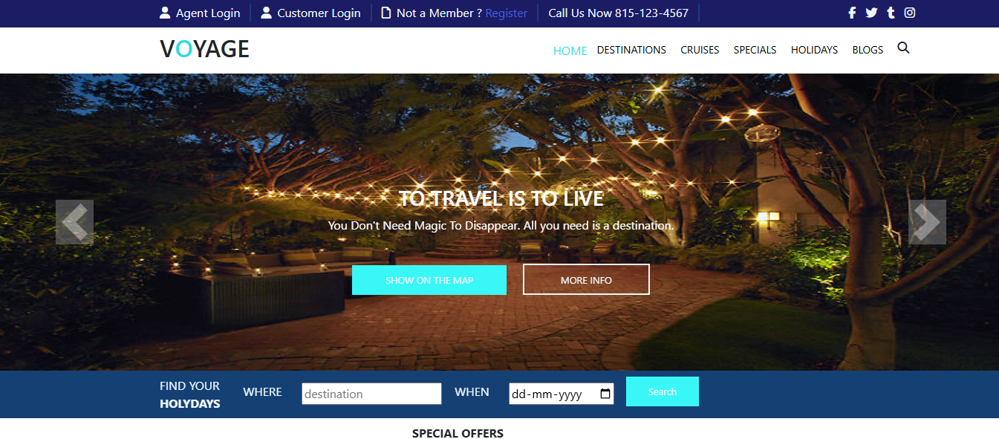

# Voyage Travel Website

A travel agency website built with Bootstrap, featuring sections for destinations, cruises, specials, holidays, and blogs. The site includes a responsive carousel, dropdown menus, and client testimonials.

[](https://opensource.org/licenses/MIT)

## Table of Contents
- [Features](#features)
- [Screenshots](#screenshots)
- [Requirements](#requirements)
- [Setup](#setup)
- [Usage](#usage)
- [Project Structure](#project_structure)
- [Technologies](#technologies)
- [Contributing](#contributing)
- [License](#license)

## Features
- **Responsive Design**: Built with Bootstrap 4.6.2 for cross-device compatibility.
- **Navigation**: Includes HOME, DESTINATIONS, CRUISES, SPECIALS, HOLIDAYS, and BLOGS with dropdown menus.
- **Interactive Elements**: Image zoom effects and social media integration.
- **Search Functionality**: Enables holiday planning with a search feature.

## Screenshots
| Dashboard |
|-----------|
|  |

## Requirements
- Web browser (e.g., Chrome, Firefox, Edge)
- Git (optional, for cloning the repository)
- Code editor (e.g., VS Code) for customization (optional)

## Setup
1. Clone the repository:
   ```bash
   git clone https://github.com/johnkoshy/Voyage-Travel-Website.git
   ```
2. Navigate to the project directory:
   ```bash
   cd Voyage-Travel-Website
   ```
3. Open `index.html` in a web browser to view the site:
   - Double-click `index.html`, or
   - Use a code editor like VS Code with the Live Server extension.

## Usage
1. Open the website in a browser.
2. Navigate through sections using the **Navigation Bar** (HOME, DESTINATIONS, etc.).
3. Use the **Search** feature to plan holidays.
4. Explore the **Carousel** for featured destinations and view **Testimonials**.

## Project Structure
- **index.html**: Main HTML file for the website.
- **css/**: Custom CSS styles and Bootstrap 4.6.2.
- **js/**: JavaScript files and Bootstrap dependencies.
- **screenshot/**: Stores website screenshots.
- **assets/**: Images, icons, and other static resources.

## Technologies
- **HTML5**: Markup language for structure.
- **CSS3**: Styling with Bootstrap 4.6.2.
- **JavaScript**: Interactivity and Bootstrap scripts.
- **Bootstrap 4.6.2**: Responsive design framework.
- **Font Awesome**: Icons for UI elements.

## Contributing
Contributions are welcome! 🎉 For issues, suggestions, or improvements, please open an issue or submit a pull request on [GitHub](https://github.com/johnkoshy/Voyage-Travel-Website/issues).

## License
This project is licensed under the [MIT License](LICENSE).